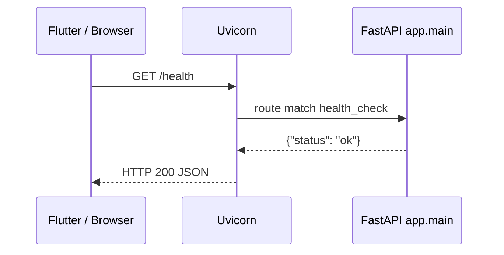

# Phase 1 — Project Setup

## Purpose

Create a runnable FastAPI skeleton so you can:

1. Understand the tools (Python, venv, pip, FastAPI, Uvicorn)
2. Run a local server
3. Call `/health` and `/version` from a browser or Flutter
4. Have empty packages ready for later phases

No Upstox calls yet. No database yet. No OAuth yet.

---

## Architecture (Phase 1)

```
Flutter / Browser
       │
       │  HTTP GET /health
       ▼
   Uvicorn (port 8000)
       │
       ▼
   FastAPI (app.main:app)
       │
       ▼
   health_check() / get_version()
```

Later phases insert layers between FastAPI and Upstox:

```
Flutter → Routes → Services → Upstox / Database
              ↑
         Dependencies (JWT, DB session)
```

---

## How it works

1. You activate `.venv` so `python` / `pip` / `uvicorn` point at this project.
2. `pip install -r requirements.txt` installs FastAPI and friends.
3. `uvicorn app.main:app --reload` imports `app` from `app/main.py` and serves it.
4. A GET to `/health` runs `health_check()` and returns JSON.

---

## Folder explanation

| Path | Role |
|------|------|
| `app/main.py` | Application factory + first two routes |
| `app/*/__init__.py` | Marks folders as Python packages so imports work |
| `requirements.txt` | Locked dependency list for pip |
| `.env` / `.env.example` | Secrets template vs real local values |
| `.gitignore` | Prevents committing `.env`, `.venv`, caches |
| `docs/` | Lessons and architecture notes |
| `tests/` | Reserved for automated tests |

---

## Flow diagram — first request



---

## Example request / response

### Health

- **Endpoint:** `GET /health`
- **Request body:** none
- **Response:**

```json
{"status": "ok"}
```

### Version

- **Endpoint:** `GET /version`
- **Request body:** none
- **Response:**

```json
{"name": "OptionEdgeAI", "version": "0.1.0"}
```

### Error example (wrong URL)

```json
{"detail": "Not Found"}
```

HTTP status: `404`

---

## Flutter HTTP example

```dart
final response = await http.get(Uri.parse('http://127.0.0.1:8000/version'));
print(response.body);
```

---

## Common mistakes (Phase 1)

| Mistake | Fix |
|---------|-----|
| `uvicorn` not found | Activate `.venv` first |
| `ModuleNotFoundError: app` | Run uvicorn from `optionedge_backend` root |
| Phone cannot connect | Use PC LAN IP + `--host 0.0.0.0`; same Wi‑Fi |
| Android emulator fails on localhost | Use `http://10.0.2.2:8000` |
| Edited code but no change | Ensure `--reload` is in the uvicorn command |

---

## What we intentionally skipped (comes later)

- Loading `.env` into typed settings → **Phase 2**
- Upstox OAuth → **Phase 3**
- JWT for Flutter → **Phase 4**
- Market / trading routes → **Phases 5–8**
