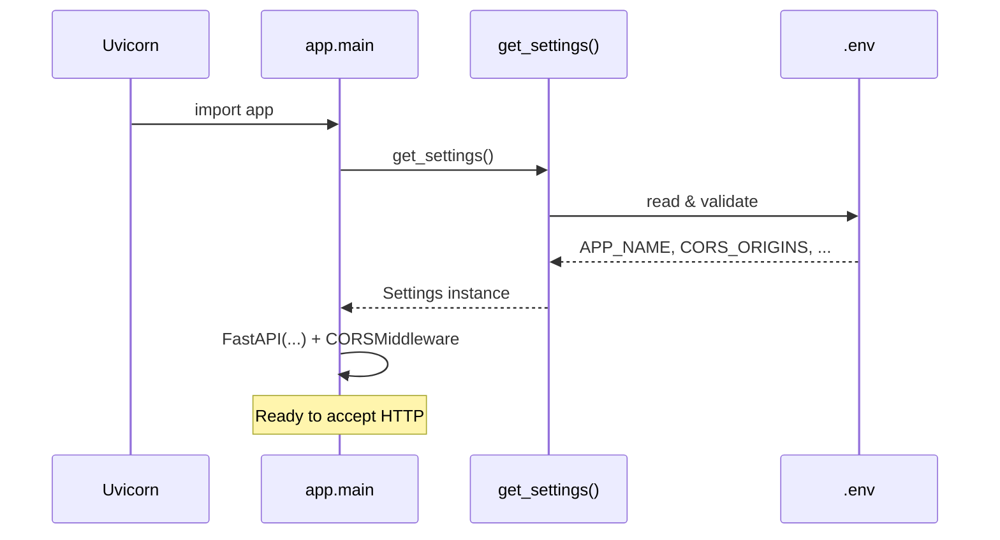

# Phase 2 — Configuration

## Purpose

Load all runtime configuration from `.env` into one typed Python object
(`Settings`) and enable CORS so Flutter web can call the API safely.

---

## Architecture

```
.env  ──►  pydantic-settings (Settings)  ──►  get_settings()
                                              │
                    ┌─────────────────────────┼─────────────────────────┐
                    ▼                         ▼                         ▼
              app.main                   (Phase 3+)                (Phase 4+)
           title, CORS,                 Upstox keys                  JWT secret
           /version env
```

---

## How it works

1. On startup, `get_settings()` creates a `Settings` instance.
2. Pydantic reads `.env` and OS environment variables.
3. Types are validated (`APP_PORT` must be an int, `APP_DEBUG` a bool, etc.).
4. `main.py` uses `settings` for FastAPI title/version and CORSMiddleware.
5. `/version` now also returns `env` from configuration.

---

## Folder / file explanation

| Path | Role |
|------|------|
| `app/config/settings.py` | `Settings` class + cached `get_settings()` |
| `app/config/__init__.py` | Re-exports for clean imports |
| `app/main.py` | Uses settings; registers CORS |
| `.env` | Real local values (gitignored) |
| `.env.example` | Safe template (committed) |

---

## Flow diagram



---

## Example request / response

### Version (updated in Phase 2)

- **Endpoint:** `GET /version`
- **Request body:** none
- **Response:**

```json
{
  "name": "OptionEdgeAI",
  "version": "0.1.0",
  "env": "development"
}
```

### Health (unchanged)

```json
{"status": "ok"}
```

---

## Flutter HTTP example

```dart
final response = await http.get(Uri.parse('http://127.0.0.1:8000/version'));
print(response.body);
// {"name":"OptionEdgeAI","version":"0.1.0","env":"development"}
```

Mobile Flutter does **not** need CORS. Flutter web does — origins must match `CORS_ORIGINS`.

---

## Best practices used here

1. One settings module — no scattered `os.getenv()` calls.
2. Cached settings — load once per process.
3. Typed fields — bad config fails at startup, not mid-trade.
4. Secrets in `.env` only — never returned from `/version` or `/health`.

## Common mistakes

| Mistake | Fix |
|---------|-----|
| `http://localhost:*` in CORS | Use exact origins or `*` alone |
| Changing `.env` but no effect | Restart uvicorn (settings are cached) |
| Putting JWT/Upstox secrets in Flutter | Keep them only in backend `.env` |
| Returning `jwt_secret_key` from an API | Never expose secrets in responses |

---

## How to test Phase 2

1. Ensure the server is running (`--reload` should pick up code changes).
2. Open http://127.0.0.1:8000/version — must include `"env":"development"`.
3. Open http://127.0.0.1:8000/docs — title still OptionEdgeAI.
4. Optional: change `APP_NAME=OptionEdgeAI-Dev` in `.env`, restart uvicorn, refresh `/version`.

---

## What comes next (Phase 3)

Upstox OAuth Authorization Code Flow: login URL, callback, token exchange.
Settings fields `upstox_*` are already defined — Phase 3 fills and uses them.
